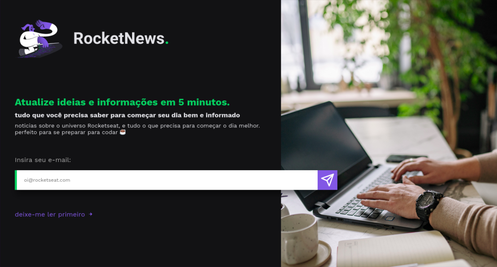

<h1 align="center">📰 RocketNews</h1>

## 💡 O que é²

É uma simples página contendo um formulário para cadastro na Newsletter.

Nesse projeto me desafiei a utilizar a [BEM ( Block Element Modifier)](http://getbem.com/), que é uma metodologia CSS utilizada para reutilização de componentes e compartilhamento de código.

## 📚 Tecnologias utilizadas

- HTML
- CSS

## 🚀 Como acessar?

Você pode acessar o projeto [Clicando aqui!](https://joaofbcastro.github.io/RocketNews/).

---

Made with 💜 by [João Castro](https://github.com/joaofbcastro).
